---
output:
  xaringan::moon_reader:
    css: [default, "metropolis_ustat.css", "metropolis-fonts", "specifici.css"]
    lib_dir: immagini
    nature:
      highlightStyle: github
      highlightLines: true
      countIncrementalSlides: false
      ratio: 16:9
    seal: false
    includes:
      after_body: insert-logo.html
---


```{r setup, include=FALSE}
rm(list=ls())

options(htmltools.dir.version = FALSE)

knitr::opts_chunk$set(fig.width=4.25, fig.height=3.5, fig.retina=3,
                      message=FALSE, warning=FALSE, cache = TRUE, 
                      autodep = TRUE, hiline=TRUE
                      , dev = "svg"
                      )

options(knitr.kable.NA = '')
# source(file = "Figure1.R", encoding = "UTF-8")

```

class: title-slide clear


# **Statistica e mondo del lavoro**
## *...solo una questione di numeri?*

<br>


### Eric Stephani (Ufficio di statistica)
### .white[.]
### Formazione specialista Job coach

### .mid-warm-grey[.font80[*19 dicembre 2022 - Pillole di networking - modulo 1*]]

---

# Statistica e mondo del lavoro

.pull-left[

##### Noi e i dati
.img-left[
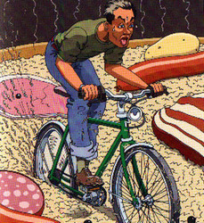
]

.font70[
.hl[Pédaler dans la choucroute]  

.font60[
.mid-warm-grey[(Figuré)] *Patauger, perdre ses moyens, perdre le fil de ses gestes, de ses pensées, de ses paroles.* .mid-warm-grey[(Expression populaire)] *Se démener sans avancer.*

]
]
]

--

.pull-right[
##### Indice
.font80[
.mid-warm-grey[1.] .hl[DA] un comunicato stampa dell'Ufficio federale di statistica  
.mid-warm-grey[2.] Dati statistici, esperienze e percezioni individuali    
.mid-warm-grey[3.] .hl[A] ... gli appuntamenti statistici
.white[.]  
.white[.]  
.white[.]  
.font70[
**Link**:  
- [www.bfs.admin.ch](https://www.bfs.admin.ch/bfs/fr/home.html) > "Actualités"  
- [www.seco.admin.ch](https://www.seco.admin.ch/seco/fr/home.html) > "Situation économique & Politique économique" > "Situation économique" > "Prévisions conjoncturelles"  

]
]
]


---
class: hide-logo, inverse, center, middle

# .font80[1.] Terzo trimestre 2022: persone occupate in aumento dello 0,8%

---
class: clear

.font70[
.left-column[
#### Persone occupate, dal 2010

]
]


.right-column[
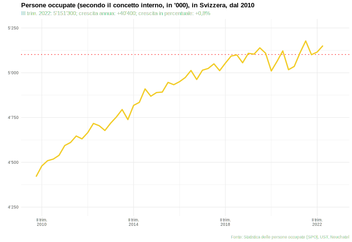

]

---
class: clear

.font70[
.left-column[
#### Persone occupate, dal 2010
#### Crescita, secondo il sesso, dal 2019

]
]

--

.right-column[
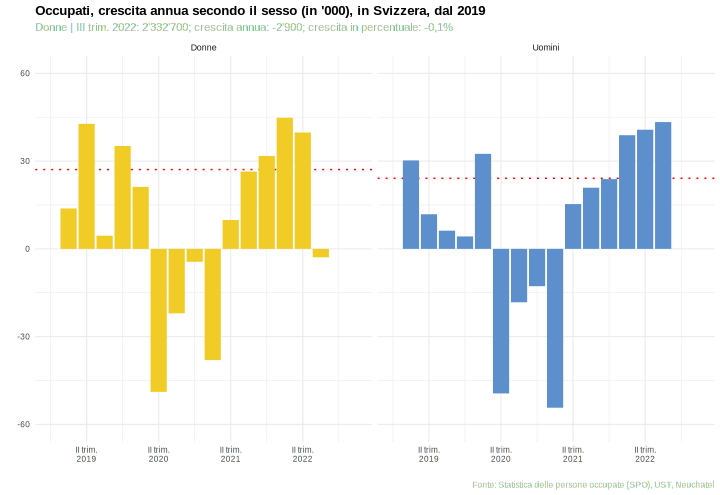
]

---
class: clear

.font70[
.left-column[
#### Persone occupate, dal 2010
#### Crescita, secondo il sesso, dal 2019
#### *Donne* | Crescita, secondo la nazionalità

]
]

--

.right-column[
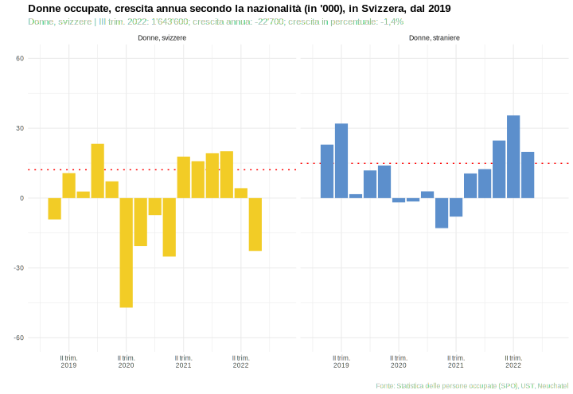
]

---
class: clear

.font70[
.left-column[
#### Persone occupate, dal 2010
#### Crescita, secondo il sesso, dal 2019
#### *Donne* | Crescita, secondo la nazionalità
#### *Donne straniere* | Crescita, secondo il tipo di permesso

]
]


.right-column[

]

---
class: clear

.font70[
.left-column[
#### Persone occupate, dal 2010
#### Crescita, secondo il sesso, dal 2019
#### *Donne* | Crescita, secondo la nazionalità
#### *Donne straniere* | Crescita, secondo il tipo di permesso
#### *Donne svizzere* | Crescita, secondo l'età

]
]


.right-column[
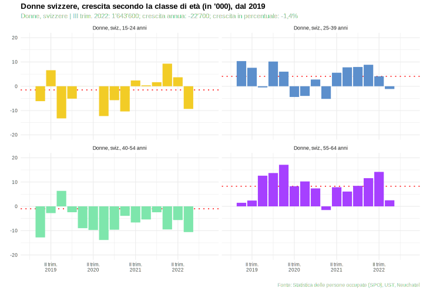
]

---
class: clear

.font70[
.left-column[
#### Persone occupate, dal 2010
#### Crescita, secondo il sesso, dal 2019
#### *Donne* | Crescita, secondo la nazionalità
#### *Donne straniere* | Crescita, secondo il tipo di permesso
#### *Donne svizzere* | Crescita, secondo l'età
#### *Uomini stranieri* | Crescita, secondo l'età

]
]


.right-column[
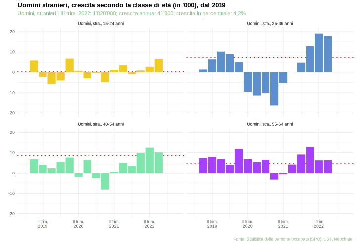
]

---
class: clear

.font60[
.left-column[
#### La situazione è preoccupante? Quanto? 
#### Questa evoluzione ci sorprende?  
#### Ma, i dati saranno  giusti?
#### ...  

]
]

.img-left[]

--

<br>
.right-column[
Queste domande sono quelle più importanti?

]

--

.right-column[
.pull-left[
SI
]

.pull-right[
.hl[NO]

]
]

---
class: hide-logo, inverse, center, middle

# .font80[2.] Il tasso di disoccupazione ILO in calo al 4,3%

---
class: clear

.font70[
.left-column[
#### Disoccupati ILO, dal 2010

]
]


.right-column[
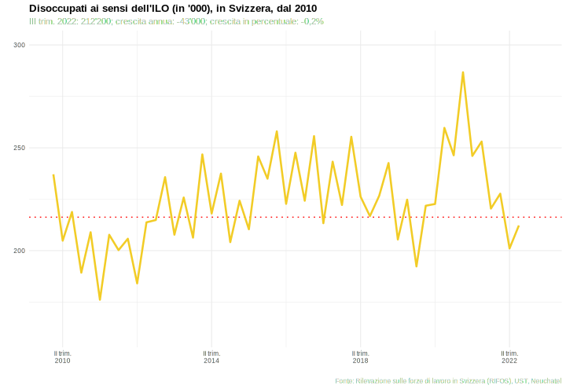
]

---
class: clear

.font70[
.left-column[
#### Disoccupati ILO, dal 2010
#### Disoccupati ILO (media)

]
]


.right-column[

]

---
class: clear

.font70[
.left-column[
#### Disoccupati ILO, dal 2010
#### Disoccupati ILO (media)
#### Disoccupati ILO, secondo il sesso (media)

]
]


.right-column[


]

---
class: clear

.font70[
.left-column[
#### Disoccupati ILO, dal 2010
#### Disoccupati ILO (media)
#### Disoccupati ILO, secondo il sesso (media)
#### Crescita, secondo il sesso, dal 2019

]
]


.right-column[
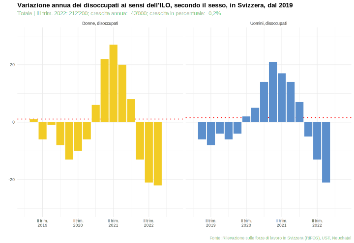
]

---
class: clear

.font70[
.left-column[
#### Disoccupati ILO, dal 2010
#### Disoccupati ILO (media)
#### Disoccupati ILO, secondo il sesso (media)
#### Crescita, secondo il sesso, dal 2019
#### *Donne* | Crescita, secondo la nazionalità

]
]


.right-column[
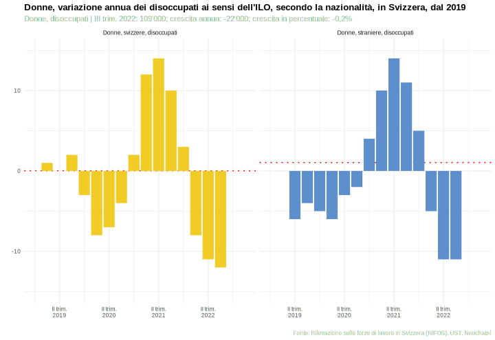

]

---
class: clear

.font70[
.left-column[
#### Disoccupati ILO, dal 2010
#### Disoccupati ILO (media)
#### Disoccupati ILO, secondo il sesso (media)
#### Crescita, secondo il sesso, dal 2019
#### *Donne*, crescita secondo la nazionalità
#### Crescita, secondo l'età

]
]


.right-column[
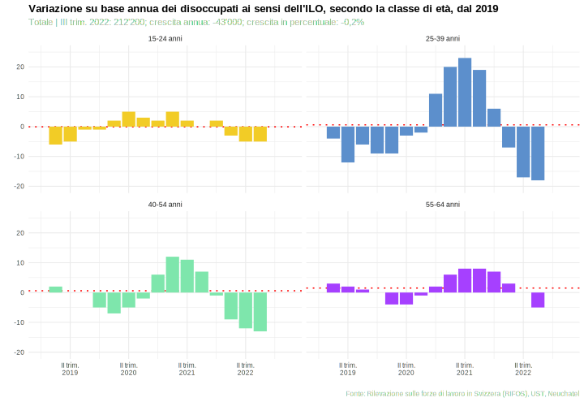

]

---
class: clear

.font70[
.left-column[
#### Disoccupati ILO, dal 2010
#### Disoccupati ILO (media)
#### Disoccupati ILO, secondo il sesso (media)
#### Crescita, secondo il sesso, dal 2019
#### *Donne*, crescita secondo la nazionalità
#### Crescita secondo l'età
#### 40-54 anni vs. 25-39 anni

]
]


.right-column[
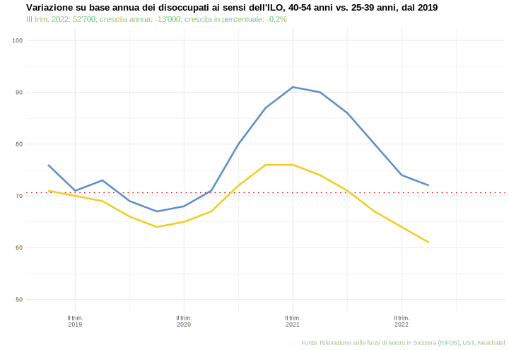
]

---
class: clear

.font70[
.left-column[
#### Le nuove domande

<br>
.img-left[]
1.
  - .hl[Da:] più occupati e meno disoccupati
  - .hl[A:] meno occupati residenti, ma anche meno disoccupati.  
  E quindi? Come si può spiegare?  

2.
  - Come *qualificare* la crescita dell'occupazione?  

]
]

--

.right-column[
<br>
#### Proposte

.font70[
- Approfondimento 1: Inattivi, per tipo, sesso e età  
- Approfondimento 2: Occupati per tempo di lavoro  
- Approfondimento 3: Evoluzione degli impieghi per settore d'attività

]
]


---
class: hide-logo, inverse, center, middle

# .font80[A1.] Evoluzione degli inattivi

---
class: clear

.font70[
.left-column[
#### Inattivi, dal 2010

]
]

--

.right-column[
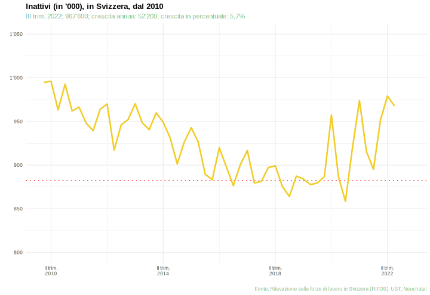

]

---
class: clear

.font70[
.left-column[
#### Inattivi, dal 2010
#### Inattivi (media)

]
]


.right-column[
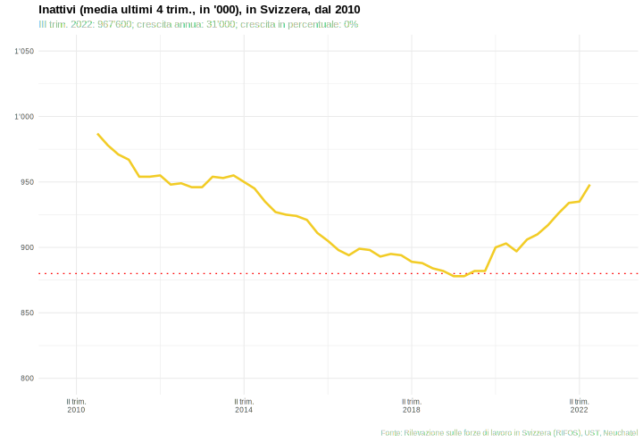

]

---
class: clear

.font70[
.left-column[
#### Inattivi, dal 2010
#### Inattivi (media)
#### Inattivi per categoria, dal 2019

]
]


.right-column[
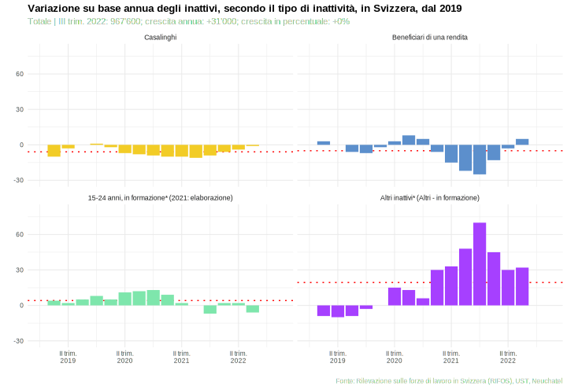

]

---
class: clear

.font70[
.left-column[
#### Inattivi, dal 2010
#### Inattivi (media)
#### Inattivi per categoria, dal 2019
#### Inattivi secondo l'età

]
]


.right-column[
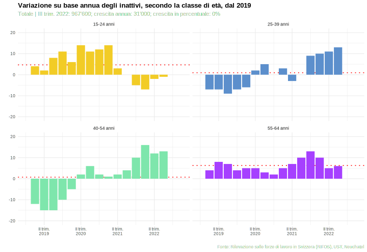
]
---
class: hide-logo, inverse, center, middle

# .font80[A1.] Evoluzione occupati per tempo di lavoro

---
class: clear

.font70[
.left-column[
#### Persone occupate residenti, dal 2010

]
]


.right-column[
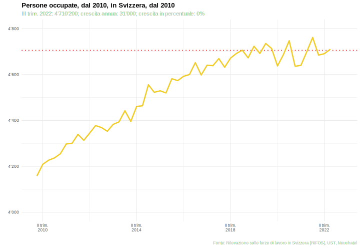

]

---
class: clear

.font70[
.left-column[
#### Persone occupate residenti, dal 2010
#### Crescita, secondo il tempo di lavoro, dal 2019

]
]


.right-column[
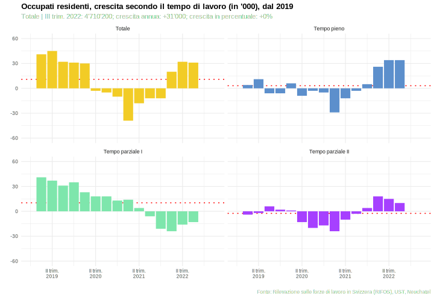

]

---
class: clear

.font70[
.left-column[
#### Persone occupate residenti, dal 2010
#### Crescita, secondo il tempo di lavoro, dal 2019
#### *Occupati a tempo pieno* | Crescita, secondo il sesso e la nazionalità

]
]


.right-column[
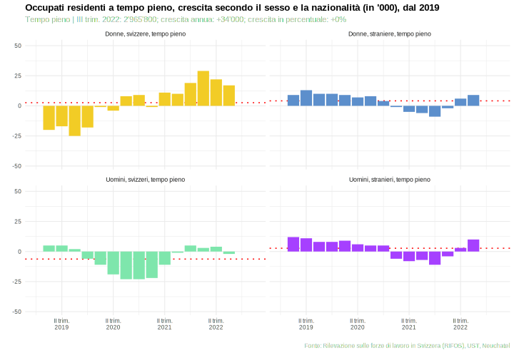

]

---
class: clear

.font70[
.left-column[
#### Persone occupate residenti, dal 2010
#### Crescita, secondo il tempo di lavoro, dal 2019
#### *Occupati a tempo pieno* | Crescita, secondo il sesso e la nazionalità
#### *Occupati a tempo parziale I* | Crescita, secondo il sesso e la nazionalità

]
]


.right-column[
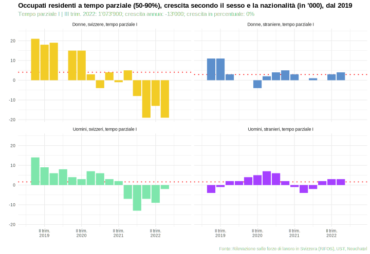

]

---
class: clear

.font70[
.left-column[
#### Persone occupate residenti, dal 2010
#### Crescita, secondo il tempo di lavoro, dal 2019
#### *Occupati a tempo pieno* | Crescita, secondo il sesso e la nazionalità
#### *Occupati a tempo parziale I* | Crescita, secondo il sesso e la nazionalità
#### *Occupati a tempo parziale II* | Crescita, secondo il sesso e la nazionalità

]
]


.right-column[
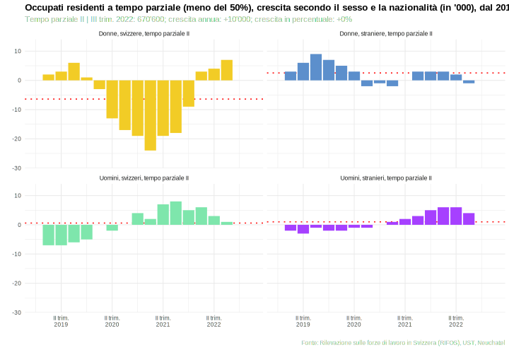

]

---
class: hide-logo, inverse, center, middle

# .font80[A1.] Evoluzione impieghi per settore d'attività

---
class: clear

.font70[
.left-column[
#### Impieghi, dal 2010

]
]


.right-column[
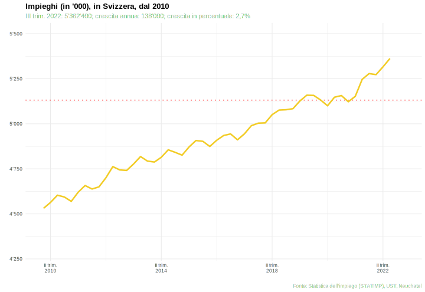

]

---
class: clear

.font70[
.left-column[
#### Impieghi, dal 2010
#### Crescita, secondo il sesso e il settore economico, dal 2019

]
]


.right-column[
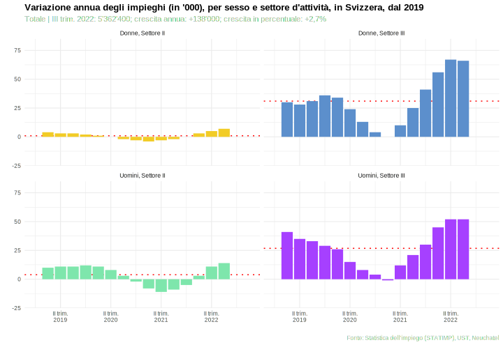

]

---
class: clear

.font70[
.left-column[
#### Impieghi, dal 2010
#### Crescita, secondo il sesso e il settore economico, dal 2019
#### *Sett. terziario* | Crescita, secondo alcune attività

]
]


.right-column[
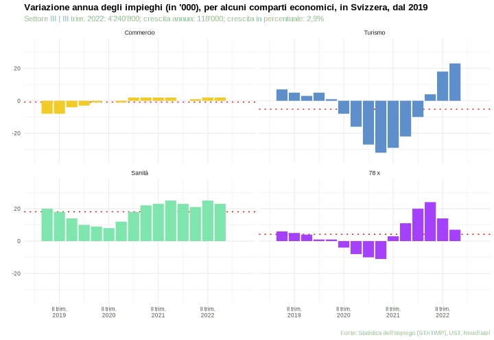

]

---
class: clear

.font70[
.left-column[
#### Impieghi, dal 2010
#### Crescita, secondo il sesso e il settore economico, dal 2019
#### *Sett. terziario* | Crescita, secondo alcune attività
#### *Ristoranti, sanità* | Crescita, secondo il sesso in alcune attività

]
]


.right-column[
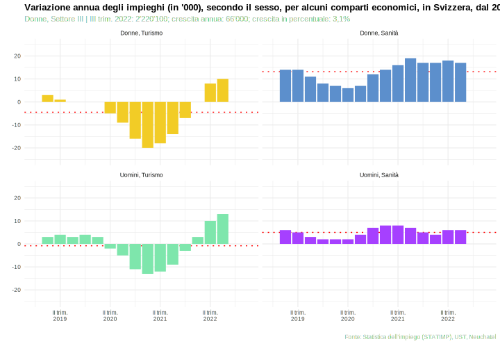

]

---

class: hide-logo, inverse, center, middle

# Conclusioni

---
class: middle clear

## Seguire le statistiche del mercato del lavoro

.mid-warm-grey[
.font70[
*Punto di partenza*

]
]

--

.pull-left[
#### Prima lettura
.img.left[]
.font50[
**Visione: molto positiva**:  
- Gli occupati crescono, la disoccupazione scende.  

**Visione: molto negativa**: 
- Crescono solo i frontalieri (e i permessi B)   

**Visione media**:  
- .hl[~~ma, i dati saranno sbagliati~~]

]
]

--

.pull-right[
#### Un'analisi .hl["allargata"]
.img-left[]

.font50[
La situazione rimane la stessa, e rimane più o meno preoccupante, però:  
- sappiamo anche che stanno crescendo gli inattivi, in varie categorie e in diverse fasce d'età  
- sappiamo anche che l'occupazione sta crescendo in maniera diversa secondo il grado di attività    
- infine, i posti di lavoro stanno crescendo in maniera disparata

]
]

---
# Conclusioni

.pull-left[
###### .hl[DA]
.font60[**Pedaler dans la choucroute**]
<br>
.img-left[ ]
.font50[
.mid-warm-grey[(Figuré)] *Patauger, perdre ses moyens, perdre le fil de ses gestes, de ses pensées, de ses paroles.* .mid-warm-grey[(Expression populaire)] *Se démener sans avancer.*

]
]

--

.pull-right[

###### .hl[A]
.font60[**Imparare a pedalare**]
<br>
.img-left[ ]
.font50[
.mid-warm-grey[(Modo di dire)] *Andare in bicicletta è una di quelle attività che, una volta imparate, non si dimenticano mai*

]
]


---

# Corollario

.pull-left[
.font70[
##### Articoli, approfondimenti
- Stephani, E. (2020). *Focus sul mercato del lavoro in Ticino*. Corso organizzato da Inserimento svizzera, sezione Ticino  

    - [primo incontro](https://ericsteph.github.io/statistica2020_intro)  
    - [secondo incontro](https://ericsteph.github.io/statistica2020_scnd)  
    
- Stephani, E. (2020). *Crisi economica o un'ineffabile eco. Con quali e quanti rimbalzi?*. [Dati, n. 2](https://www3.ti.ch/DFE/DR/USTAT/index.php?fuseaction=pubblicazioni.dettaglioVolume&t=1&idCollana=3&idVolume=2581)

]
]


.pull-right[

.font70[
##### Schede, progetti
- SECO. *Previsioni coniunturali*, [www.seco.admin.ch](https://www.seco.admin.ch/seco/fr/home/wirtschaftslage---wirtschaftspolitik/Wirtschaftslage/konjunkturprognosen.html)  
- USTAT. *Monitoraggio congiunturale*, URL breve: [www.ti.ch/ustat-schede-congiuntura](https://www3.ti.ch/DFE/DR/USTAT/index.php?fuseaction=pubblicazioni.dettaglioVolume&t=3&idCollana=481&idVolume=2604)  
- USTAT. *Panorama statistico del mercato del lavoro*, URL breve: [www.ti.ch/ustat-schede-lavoro](https://www3.ti.ch/DFE/DR/USTAT/index.php?fuseaction=pubblicazioni.dettaglioVolume&t=3&idCollana=481&idVolume=1361)  

]
]


.font60[
<br>
<br>
<br>
<br>
<br>
.mid-warm-grey[
Slides create con R via: [{r-project}](https://www.r-project.org) e [{xaringan}](https://github.com/yihui/xaringan)

]
]

---

class: title-slide-fin clear hide-logo


# .white[.]

.font70[
.pull-right2[

#### **Contatti**
Eric Stephani  
[eric.stephani@ti.ch](mailto:eric.stephani@ti.ch)  

.white[ ]  
Repubblica e Canton Ticino  
Divisione delle risorse  
**Ufficio di statistica**  
[www.ti.ch/ustat](http://www.ti.ch/ustat)

]
]


